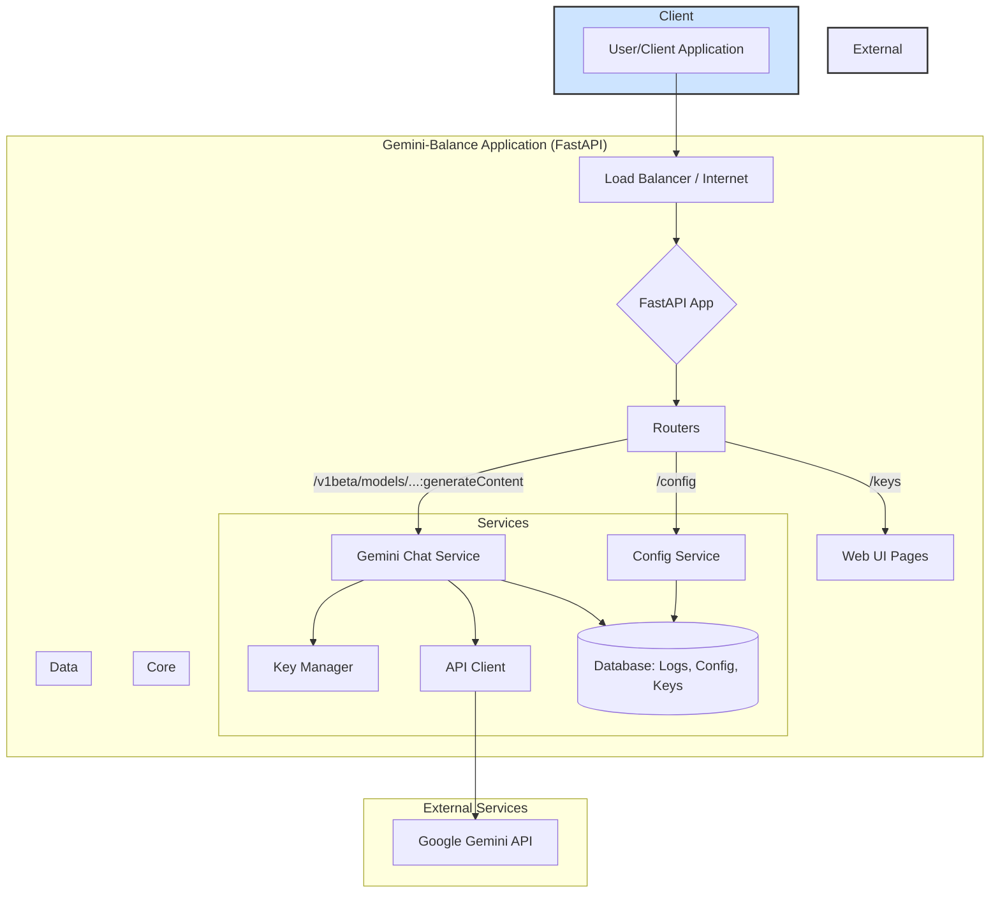

# CLAUDE.md

This file provides guidance to Claude Code (claude.ai/code) when working with code in this repository.

## Development Commands

### Running the Application
```bash
# Install dependencies
pip install -r requirements.txt

# Run locally for development (with auto-reload)
uvicorn app.main:app --host 0.0.0.0 --port 8000 --reload

# Run in production mode
uvicorn app.main:app --host 0.0.0.0 --port 8000
```

### Docker Commands
```bash
# Build Docker image
docker build -t gemini-balance .

# Run with Docker
docker run -d -p 8000:8000 --env-file .env gemini-balance

# Run with volume mount for SQLite persistence
docker run -d -p 8000:8000 --env-file .env -v /path/to/data:/app/data gemini-balance

# Pull and run pre-built image
docker pull ghcr.io/snailyp/gemini-balance:latest
docker run -d -p 8000:8000 --env-file .env ghcr.io/snailyp/gemini-balance:latest

# Run with Docker Compose (includes MySQL database)
docker-compose up -d
```

## Architecture Overview

The `gemini-balance` application is a sophisticated proxy server built with Python and the FastAPI framework. Its primary purpose is to act as an intermediary for Google's Gemini API, providing key features like load balancing across multiple API keys, request logging, dynamic configuration, and a web interface for management and monitoring.



### Core Architecture
- **FastAPI Application**: Main web framework with async support
- **Database Layer**: Supports both SQLite and MySQL via SQLAlchemy with async drivers
- **Key Management**: Round-robin load balancing across multiple Gemini API keys with failure handling
- **Dual API Compatibility**: Supports both Gemini native API and OpenAI-compatible endpoints
- **Middleware Stack**: Request logging, smart routing, and authentication

### Key Components

**Application Entrypoint** (`app/main.py`)
- The application starts with `app/main.py`.
- It uses `dotenv` to load environment variables from a `.env` file.
- It calls the `create_app()` function from `app.core.application` to build the FastAPI application instance.
- It uses `uvicorn` as the ASGI server to run the application.

**Application Bootstrap** (`app/core/application.py`):
- The `create_app()` function is the central factory for constructing the application.
- **Lifespan Management:** It uses FastAPI's `@asynccontextmanager(lifespan)` to manage startup and shutdown events gracefully.  Lifespan management with startup/shutdown hooks.
  - **On Startup**: It connects to the database, synchronizes settings from the database, initializes the API key manager, starts a background scheduler for periodic tasks (like checking key validity), and checks for application updates.
  - **On Shutdown**: It stops the scheduler and disconnects from the database.
- **Configuration:** It sets up static file serving for CSS/JS and the Jinja2 templating engine for the web UI.
- **Middleware, Routers, and Exceptions:** It orchestrates the setup of middleware, registers all API and page routers, and sets up global exception handlers for centralized error management.
- **Database** initialization and connection pooling
- **Scheduler** startup for background tasks

**Configuration Management** (`app/config/config.py`):
- This is one of the most powerful parts of the application. It uses Pydantic's `BaseSettings` to define a strongly-typed `Settings` class.
- **Multi-source Configuration:** Settings are loaded from environment variables and `.env` files.
- **Dynamic DB Sync:** The `sync_initial_settings()` function synchronizes these settings with a database table. This allows administrators to change the application's behavior dynamically through the web UI without restarting the server, as the database values take precedence.

**Service Layer** (`app/service/`):
- **Chat Services**: Separate implementations for Gemini, OpenAI, and Vertex Express
- **TTS Services**: Native Gemini TTS support with intelligent detection and OpenAI-compatible TTS
- **Key Manager**: Handles API key rotation, failure tracking, and recovery
- **Model Service**: Dynamic model list management and filtering
- **File Services**: File upload handling with multiple providers (SMMS, PicGo, Cloudflare)
- **Image Services**: Image generation via Imagen models
- **Embedding Services**: Text embedding functionality
- **Stats/Logging**: Request tracking and error logging with auto-cleanup

**Core Business Logic** (`app/service/chat/gemini_chat_service.py`):
- The `GeminiChatService` class contains the main logic for handling chat requests.
- **Payload Construction:** The `_build_payload` function is responsible for constructing the JSON payload sent to the Gemini API. It intelligently adds tools (like `codeExecution` or `googleSearch`), `safetySettings`, and `thinkingConfig` based on the model and application settings.
- **API Key Management:** It works with the `KeyManager` to get a valid API key for each request.
- **Request Handling:** It has methods for both standard (`generate_content`) and streaming (`stream_generate_content`) requests.
- **Error Handling & Retries:** The streaming method includes a retry loop. If a request fails with an API key, it reports the failure to the `KeyManager` and attempts the request again with a new key, which is the core of the load balancing and resilience feature.
- **Logging:** It logs every request and error to the database for monitoring and debugging.
- **Stream Optimization:** It uses a `stream_optimizer` to improve the perceived performance of the streaming response, sending smaller chunks of text more quickly.

**Router Layer** (`app/router/`):
- **Gemini Routes**: Native Gemini API endpoints (`/v1beta`) with TTS support
- **OpenAI Compatible Routes**: Both HuggingFace format (`/hf/v1`) and standard (`/openai/v1`)
- **Vertex Express Routes**: Google Vertex AI Express endpoints
- **File Routes**: File upload and management endpoints
- **Admin Routes**: Configuration, stats, error logs, key status, and scheduler monitoring

**Routing** (`app/router/routes.py`):

The `setup_routers()` function includes all the different API routers in a modular way. This includes:
  - `gemini_routes.py`: Handles the core proxying of requests to the Gemini API.
  - `openai_routes.py`: Provides an OpenAI-compatible API endpoint.
  - `config_routes.py`: API for the web UI to read/write configuration.
  - `stats_routes.py`, `error_log_routes.py`: APIs for retrieving statistics and logs.

It also defines the routes for the web UI pages (`/`, `/keys`, `/config`, `/logs`), which use Jinja2 templates and are protected by a simple token-based authentication.

**Database Design** (`app/database/`):
- Async database operations with connection pooling
- Models for configuration, request logs, error logs, and statistics
- Auto-migration and initialization support

### Configuration System
- Environment-based configuration via Pydantic Settings
- Dynamic configuration updates through admin interface
- Database-persisted settings that override environment variables
- Support for complex JSON configurations (safety settings, model mappings)

### Key Features
- **Load Balancing**: Round-robin key selection with automatic failure handling
- **Stream Optimization**: Optional response streaming enhancement
- **Multi-Modal Support**: Text, image, audio, and video input processing
- **Image Processing**: Integration with multiple image hosting providers (SMMS, PicGo, Cloudflare)
- **Image Generation**: Imagen-3.0 support for image creation
- **Search Integration**: Web search capabilities for supported models
- **Advanced TTS Support**: 
  - Native Gemini TTS with single and multi-speaker support
  - OpenAI-compatible TTS endpoints
  - Intelligent detection and automatic routing
- **File Management**: Comprehensive file upload and processing system
- **Embedding Services**: Text embedding functionality
- **Security**: Token-based authentication with role-based access
- **Health Monitoring**: Scheduled tasks for key health checks and system maintenance

## Important Implementation Notes

- Configuration changes made through the admin interface take effect immediately without restart
- The application uses async/await patterns throughout for better performance
- Image generation requires a separate paid API key (`PAID_KEY`)
- Models with special suffixes (`-image`, `-search`, `-tts`) enable additional functionality
- Error logs and request logs have configurable auto-deletion
- The scheduler runs background tasks for key health checks and log cleanup
- TTS functionality supports both native Gemini format and OpenAI-compatible endpoints
- File uploads support multiple providers and automatic format conversion
- Multi-modal inputs (audio/video) are automatically processed and converted to appropriate formats
- The system includes intelligent routing middleware for optimal request handling

## TTS Architecture

The application includes comprehensive TTS support with three different systems:

1. **Native Gemini TTS** (`/v1beta/models/{model}:generateContent`):
   - Supports both single-speaker and multi-speaker voice synthesis
   - Intelligent detection based on `responseModalities: ["AUDIO"]` and `speechConfig`
   - Dynamic model selection via URL parameters
   - Automatic fallback to standard chat service if TTS processing fails

2. **OpenAI-Compatible TTS** (`/v1/audio/speech`):
   - Standard OpenAI TTS API format
   - Fixed model configuration
   - Direct audio file response

3. **Intelligent Routing**:
   - Automatic detection of TTS requests vs. regular chat requests
   - Zero-configuration TTS enablement
   - Maintains full backward compatibility with existing functionality

## Multi-Modal Support

The system processes various input formats:
- **Text**: Standard text input and generation
- **Images**: Upload, processing, and generation via Imagen models
- **Audio/Video**: Automatic format detection and Base64 conversion
- **Files**: Comprehensive upload system with multiple provider support
